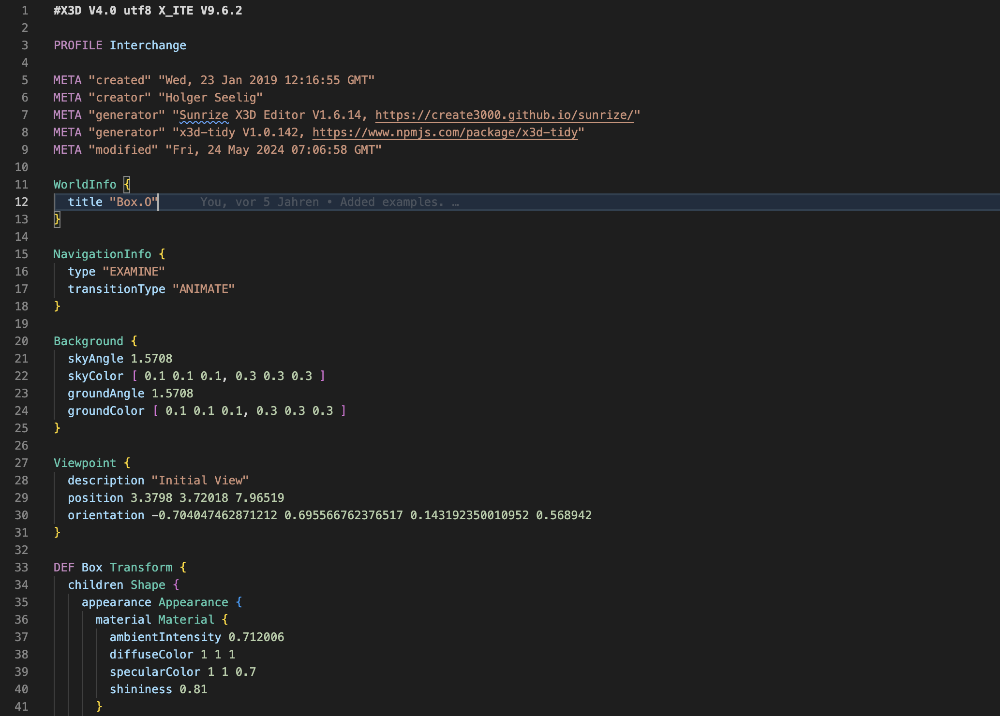

# X3D Syntax Highlighting

This Extension adds syntax highlighting support for X3D XML Encoding (x3d), X3D Classic VRML Encoding (.x3dv), X3D JSON Encoding (.x3dj) and VRML 2.0 (.wrl) to VS Code.

## License

This software is licensed under the [MIT License](LICENSE.md).

## See Also

* [X_ITE VS Code Extension](https://marketplace.visualstudio.com/items?itemName=create3000.x-ite-vscode)
* [X_ITE VS Code Formatter](https://marketplace.visualstudio.com/items?itemName=create3000.x-ite-vscode-formatter)
